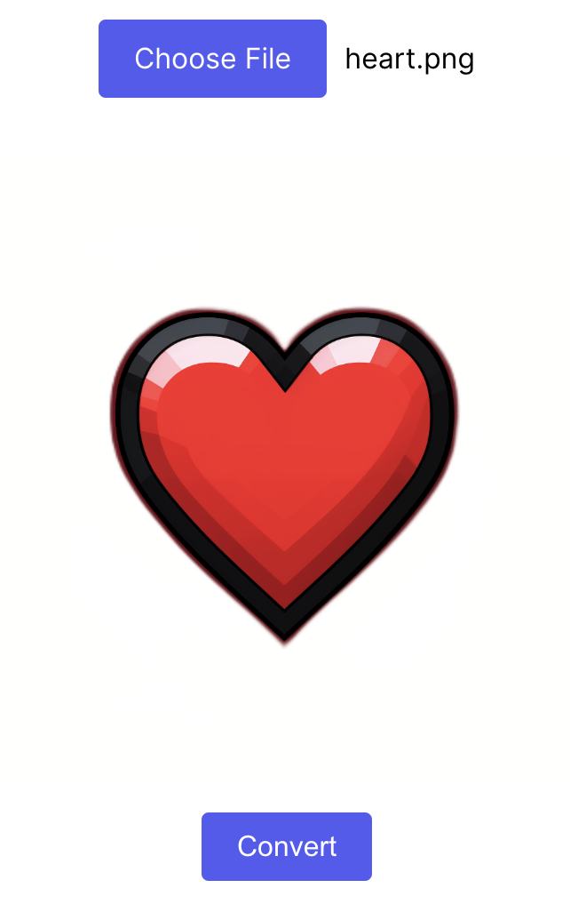

# Image to Greyscale Converter

A handy tool that converts your colorful images to greyscale. Simply upload an image and get a live preview of it. Click the "convert" button to transform the image into greyscale and view the result immediately. Once satisfied, you can download the greyscale image at the click of a button.

### 1. Choose image

### 2. Preview of original image

### 3. Preview of greyscale image

### 4. Download

## How to Use

1. **Upload**: Drag and drop or click the upload section to choose your desired image.
2. **Preview**: After uploading, a preview of your image will be rendered on a canvas.
3. **Convert**: Click the "convert" button to transform your image into greyscale. The result will be showcased right below the original preview.
4. **Download**: If you're satisfied with the result, click the "download" button to save the greyscale image to your device.

## Live Demo

Experience the converter live: [Greyscale Converter](http://barrymun.greyscale.surge.sh/)

## License

This project is licensed under the MIT License. You can find detailed information in the [LICENSE](./LICENSE) file located in the root directory.

